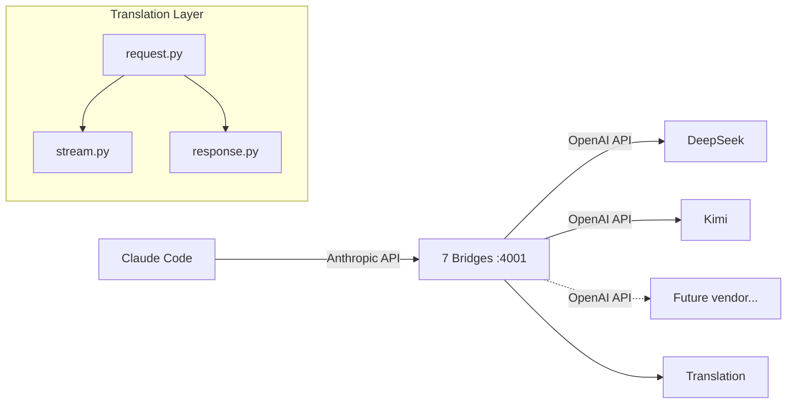

# 7 Bridges of Claude

[](https://github.com/sdkks/7bridges/actions/workflows/release.yml)

An [Anthropic Messages API](https://docs.anthropic.com/en/api/messages) proxy that lets **Claude Code** (and other Anthropic clients) talk to non-Anthropic LLMs through clean, explicit translations.

> **Agentic development guide:** See [`CLAUDE.md`](CLAUDE.md) (also symlinked as [`AGENTS.md`](AGENTS.md)) for conventions on testing integrity, development cadence, backend capability audits, and common pitfalls when working with this codebase.

# What's new?

- Added support for SiliconFlow (MiniMax M2.5, Kimi K2.6, GLM 5.1), Fireworks AI (Kimi K2.6, MiniMax M2.7), Xiaomi MiMo (MiMo V2.5 Pro, MiMo V2.5), and Ollama. Some working examples are further down.

<br>

https://github.com/user-attachments/assets/8e6fa365-d528-4307-ad36-61fa040a4cc2

<br>
<br>

- We have a new dashboard which you can run optionally to see usage attribution and some other metrics.

<br>

https://github.com/user-attachments/assets/555bf70f-8017-4760-94c7-c745e95f2f33


## Table of Contents

- [Why I Built This](#why-i-built-this)
- [What You Need](#what-you-need)
- [Quick Start (5 Minutes)](#quick-start-5-minutes)
- [Pick a Model](#pick-a-model)
- [Run It](#run-it)
- [Usage Examples](#usage-examples)
- [Logging](#logging)
- [Troubleshooting](#troubleshooting)
- [Development](#development)
- [Architecture](#architecture)
- [Project Structure](#project-structure)
- [Backlog](BACKLOG.md)
- [License](#license)

---

## Why I Built This

I wanted to use other models (DeepSeek, Kimi, Ollama, etc.) with Claude Code without fighting LiteLLM every step of the way. With LiteLLM I kept running into:

- **Reasoning/thinking blocks** not being translated correctly — Claude Code expects `thinking` content blocks with signatures; LiteLLM either drops them or mangles the format
- **Cache token accounting** being inconsistent — `cache_read_input_tokens` and `cache_creation_input_tokens` would be missing or wrong
- **Streaming SSE** breaking on edge cases — empty deltas, usage-only chunks, or `data:` lines without spaces would cause silent failures
- **Too many moving parts** — LiteLLM's broad-compatibility approach means dozens of internal transformation pipelines, any of which can break for Anthropic-specific features

This project takes the opposite approach: **small, explicit, per-backend translations** where every field that crosses the boundary is deliberately mapped and tested.

## Vision

Every non-Anthropic model speaks the **Anthropic Messages API** (`/v1/messages`). The bridge is a translation layer — nothing more. You point Claude Code at `localhost:4001`, pick a model alias like `claude-opus-4-6`, and the bridge forwards your request to the actual upstream (Kimi, DeepSeek, etc.), then translates the response back into native Anthropic format including:

- `thinking` blocks with reasoning content
- `tool_use` / `tool_result` blocks
- `image` input blocks (where upstream supports vision)
- Streaming SSE events (`message_start`, `content_block_delta`, `message_stop`)
- Proper `usage` with cache accounting

## Architecture



Each backend is a "bridge":
- Receives Anthropic-format `MessagesRequest`
- Translates to the backend's native request format
- Forwards the request via HTTP
- Translates the native response back to Anthropic-format `MessagesResponse`
- Handles streaming SSE translation chunk-by-chunk

## Bridges

| Bridge | Backend | Model | Vision | Reasoning | Tools | Status |
|---|---|---|---|---|---|---|
| DeepSeek | `api.deepseek.com` | `deepseek-v4-pro` (Sonnet), `deepseek-v4-flash` (Haiku) | ❌ | ✅ | ✅ | Live |
| Kimi | `api.kimi.com/coding/v1` | `kimi-for-coding` (K2.6) | ✅ | ✅ | ✅ | Live |
| Ollama | `localhost:11434` | Configurable via env vars | ✅ | ✅ | ✅ | Live |
| SiliconFlow | `api.siliconflow.com/v1` | MiniMax M2.5, GLM 5.1 | ❌ | ✅ | ✅ | Live |
| SiliconFlow | `api.siliconflow.com/v1` | Kimi K2.6 | ✅ | ✅ | ✅ | Live |
| Fireworks AI | `api.fireworks.ai/inference/v1` | Kimi K2.6 | ✅ | ✅ | ✅ | Live |
| Fireworks AI | `api.fireworks.ai/inference/v1` | MiniMax M2.7 | ❌ | ✅ | ✅ | Live |
| Xiaomi MiMo | `token-plan-sgp.xiaomimimo.com/v1` | `mimo-v2.5-pro` (Pro), `mimo-v2.5` (Flash) | ✅ | ✅ | ✅ | Live |

> **Note on vision/image support:** DeepSeek v4 does not natively support image input. By default, image requests to DeepSeek receive a **soft 200 rejection** with guidance to use OCR/DOM fallbacks instead of a fatal 400 error. For full vision support, you can either use the **Kimi bridge** (`claude-opus-4-6` or `claude-opus-4-7`) which maps to Kimi K2.6, or enable the experimental **vision fallback** feature that routes images to a separate VL backend (Kimi or Ollama) and feeds the text description back to the blind model. See [docs/VISION_FALLBACK.md](docs/VISION_FALLBACK.md).

### Model Aliases

| Alias | Backend | Actual Model | Context | Max Output |
|---|---|---|---|---|
| `claude-sonnet-4-6` | DeepSeek | `deepseek-v4-pro` | 1,048,576 | 393,216 |
| `claude-haiku-4-5` | DeepSeek | `deepseek-v4-flash` | 1,048,576 | 393,216 |
| `claude-opus-4-6` | Kimi | `kimi-for-coding` | 262,144 | 32,768 |
| `claude-opus-4-7` | Kimi | `kimi-for-coding` | 262,144 | 32,768 |
| `ollama-sonnet` | Ollama | `qwen3.6:35b-a3b-coding-nvfp4` | 32,768 | 8,192 |
| `ollama-haiku` | Ollama | `qwen3.5:9b` | 65,536 | 8,192 |
| `ollama-gpt-oss` | Ollama | `gpt-oss:20b` | 65,536 | 8,192 |
| `ollama-gemma` | Ollama | `gemma4:26b` | 65,536 | 8,192 |
| `siliconflow-minimax-m2.5` | SiliconFlow | `MiniMaxAI/MiniMax-M2.5` | 196,608 | 196,608 |
| `siliconflow-kimi-k2.6` | SiliconFlow | `moonshotai/Kimi-K2.6` | 262,144 | 262,144 |
| `siliconflow-glm-5.1` | SiliconFlow | `zai-org/GLM-5.1` | 200,000 | 131,072 |
| `fireworks-kimi-k2p6` | Fireworks AI | `accounts/fireworks/models/kimi-k2p6` | 262,144 | 262,144 |
| `fireworks-minimax-m2p7` | Fireworks AI | `accounts/fireworks/models/minimax-m2p7` | 204,800 | 131,072 |
| `mimo-v2.5-pro` | Xiaomi MiMo | `mimo-v2.5-pro` | 1,000,000 | 131,072 |
| `mimo-v2.5` | Xiaomi MiMo | `mimo-v2.5` | 1,000,000 | 131,072 |

### Per-Bridge Notes

**Kimi (`claude-opus-4-6`, `claude-opus-4-7`)**

- **Thinking / reasoning:** The bridge does not send a `thinking` parameter to Kimi. Kimi's API defaults `thinking.type` to `"enabled"` when the field is absent, so reasoning is active by default. Explicitly setting `thinking: {"type": "disabled"}` in the Anthropic request is currently ignored — reasoning will still occur. Kimi does not support `budget_tokens` or `reasoning_effort`; there is no way to control reasoning depth.
- **Context window:** The bridge advertises `262,144` tokens in the `/v1/models` response. Kimi K2.6 genuinely supports this. However, Claude Code uses its own hardcoded model catalog for known Anthropic aliases and may assume a larger context window (200K or 1M for Opus-tier models) for session compaction decisions. If Claude Code accumulates a context larger than 256K tokens before compacting, Kimi will reject the request. The bridge does not validate context size — Kimi's error is forwarded as-is.

**DeepSeek (`claude-sonnet-4-6`, `claude-haiku-4-5`)**

- **Thinking / reasoning:** The bridge maps Anthropic `thinking.type` to DeepSeek's `thinking` object, and `output_config.effort` to DeepSeek's `reasoning_effort`. DeepSeek aliases effort tiers server-side (`low`/`medium` → `high`, `xhigh` → `max`).

**SiliconFlow (`siliconflow-kimi-k2.6`, `siliconflow-minimax-m2.5`, `siliconflow-glm-5.1`)**

- **Thinking / reasoning:** The bridge maps Anthropic `thinking.type` to `enable_thinking` (bool) and `output_config.effort` to a token budget (`thinking_budget`). Budget mapping: `low`→4096, `medium`→8192, `high`→16384, `xhigh`→24576, `max`→32768.

**Fireworks AI (`fireworks-kimi-k2p6`, `fireworks-minimax-m2p7`)**

- **Thinking / reasoning:** Kimi K2.6 via Fireworks accepts the Anthropic-compatible `thinking` object with `type` and `budget_tokens`. MiniMax M2.7 only accepts `reasoning_effort` string (`low`/`medium`/`high`); the bridge converts accordingly.

**Xiaomi MiMo (`mimo-v2.5-pro`, `mimo-v2.5`)**

- **Thinking / reasoning:** MiMo returns `reasoning_content` natively, which the bridge maps to Anthropic `thinking` blocks. Reasoning is always active — there is no `thinking` toggle; the model decides when to reason.
- **Prompt caching:** Enabled via `prompt_cache_key` forwarded from `x-claude-code-session-id`. Cache hits are reflected in `cache_read_input_tokens`. Cache threshold is ~1000+ tokens — smaller prefixes won't trigger caching.
- **Vision:** Full multimodal support (native image input).
- **Context window:** 1,000,000 tokens.
- **Auth:** Uses the `api-key` header (not `Authorization: Bearer`). Token plan keys are created in the MiMo console under Subscription Details.

> **Full details:** See [`docs/BRIDGE_NOTES.md`](docs/BRIDGE_NOTES.md) for vision support, known quirks, and free tier notes.

## Ollama Setup

The Ollama bridge talks to your local Ollama instance via the [ollama-python SDK](https://github.com/ollama/ollama-python). The aliases `ollama-sonnet`, `ollama-haiku`, `ollama-gpt-oss`, and `ollama-gemma` map to open-weight models that serve as rough local analogues for the Anthropic model tiers — they trade some capability for zero-cost, offline, private inference. Models are configured through environment variables in `.envrc`:

```sh
export OLLAMA_HOST="http://127.0.0.1:11434"
export OLLAMA_SONNET_MODEL="qwen3.6:35b-a3b-coding-nvfp4"
export OLLAMA_SONNET_CONTEXT_WINDOW=32768
export OLLAMA_HAIKU_MODEL="qwen3.5:9b"
export OLLAMA_HAIKU_CONTEXT_WINDOW=65536
export OLLAMA_GPTOSS_MODEL="gpt-oss:20b"
export OLLAMA_GPTOSS_CONTEXT_WINDOW=65536
export OLLAMA_GEMMA_MODEL="gemma4:26b"
export OLLAMA_GEMMA_CONTEXT_WINDOW=65536
export OLLAMA_KEEP_ALIVE="300s"
```

**Pull the models you want before using them:**

```sh
ollama pull qwen3.6:35b-a3b-coding-nvfp4
ollama pull qwen3.5:9b
ollama pull gpt-oss:20b
ollama pull gemma4:26b
```

### Using Ollama models in Claude Code

Ollama models use the aliases `ollama-sonnet`, `ollama-haiku`, `ollama-gpt-oss`, and `ollama-gemma`. They are **not** listed in the default `/model` picker (Claude Code filters to known Anthropic aliases). Switch to them explicitly:

```
/model ollama-sonnet
/model ollama-haiku
/model ollama-gpt-oss
/model ollama-gemma
```

> **Tip:** Bump the context window in `.envrc` if your hardware allows it. `OLLAMA_SONNET_CONTEXT_WINDOW` and `OLLAMA_HAIKU_CONTEXT_WINDOW` control the `num_ctx` parameter passed to Ollama. These defaults were tested on an Apple Silicon M2 Pro with 32 GB unified memory — your own limits will vary with hardware and the models you choose. Measure the tradeoffs and adjust via env vars.

> **Known quirk:** `ollama-gpt-oss` has a ~50% failure rate on first-time `Write` tool calls — the model sometimes emits the tool call with incomplete parameters. Subsequent retries almost always succeed as the model corrects itself.

See [`docs/OLLAMA_MODELS.md`](docs/OLLAMA_MODELS.md) for full capabilities, architecture details, and per-model notes.

---

## What You Need

| Requirement | What It Is | How to Check |
|---|---|---|
| **Python 3.13+** | The programming language this tool is written in | `python3 --version` |
| **uv** | A fast Python package manager | `uv --version` |
| **Git** | To download this project | `git --version` |
| **An API key** | From at least one backend provider | See below |

**You do NOT need all of these.** Pick one backend and get one API key. Many are free to try with credit.

> **Windows users:** This project runs on Linux and macOS. Use [WSL2](https://learn.microsoft.com/en-us/windows/wsl/install) and follow the Linux instructions.

---

## Quick Start (5 Minutes)

If you already have `uv` installed and an API key ready:

```bash
# 1. Download the project
git clone https://github.com/sdkks/7bridges.git
cd 7bridges

# 2. Create the Python environment and install dependencies
uv venv --python 3.13
source .venv/bin/activate
uv pip install -e ".[dev]"

# 3. Set your API key (example: DeepSeek)
export DEEPSEEK_API_KEY="sk-xxxxxxxxxxxxxxxxxxxxxxxx"
export BRIDGE_API_KEY="ollama"  # this is the password Claude Code will use

# 4. Start the server
uvicorn seven_bridges.main:app --reload --port 4001
```

In another terminal:

```bash
# 5. Point Claude Code at the bridge
export ANTHROPIC_BASE_URL="http://localhost:4001"
export ANTHROPIC_API_KEY="ollama"
claude
```

Then inside Claude Code, pick a model:

```
/model claude-sonnet-4-6
```

Done! To verify it's working, try:

```bash
curl http://localhost:4001/v1/models
curl -X POST http://localhost:4001/v1/messages \
  -H "x-api-key: ollama" \
  -H "Content-Type: application/json" \
  -d '{"model": "claude-sonnet-4-6", "messages": [{"role": "user", "content": "Hi"}], "max_tokens": 10}'
```

> **New here?** See [`docs/GETTING_STARTED.md`](docs/GETTING_STARTED.md) for a full step-by-step walkthrough with platform-specific instructions (macOS, Linux, WSL2), per-backend setup guides, and environment variable explanations.

---

## Pick a Model

**New to this?** Start here:

| If you want... | Use this alias | Backend | Cost | Notes |
|---|---|---|---|---|
| Best overall quality | `claude-opus-4-6` | Kimi K2.6 | Paid | Excellent reasoning, vision, tools. 262K context. |
| Fast and cheap | `claude-haiku-4-5` | DeepSeek v4-flash | Paid | Very fast, 1M context, great for quick tasks. |
| Good balance | `claude-sonnet-4-6` | DeepSeek v4-pro | Paid | Strong reasoning, 1M context, cheaper than Kimi. |
| Completely free | `ollama-sonnet` | Local Qwen 3.6 | Free | Runs on your computer. Needs ~32GB RAM. |
| Free, lighter | `ollama-haiku` | Local Qwen 3.5 | Free | Runs on your computer. Needs ~16GB RAM. |
| Vision + thinking | `mimo-v2.5-pro` | Xiaomi MiMo V2.5 Pro | Token plan | 1M context, prompt caching. |
| Budget vision | `mimo-v2.5` | Xiaomi MiMo V2.5 Flash | Token plan | 1M context, lighter/faster. |

**Full model alias reference:** See the [Model Aliases](#model-aliases) table above.

> **Per-bridge details:** Thinking/reasoning behavior, vision support, and known quirks for each backend are documented in [`docs/BRIDGE_NOTES.md`](docs/BRIDGE_NOTES.md).

---

## Run It

| Command | When to Use |
|---|---|
| `uvicorn seven_bridges.main:app --reload --port 4001` | Development — auto-reloads on code changes |
| `make run-debug` | Debugging — logs every request/response to `logs/debug/` |
| `make start` | Production — uses PM2, restarts on crash |
| `make stop` | Stop the PM2 process |
| `make logs` | Tail PM2 logs in real time |

---

## Usage Examples

### List Available Models

```bash
curl http://localhost:4001/v1/models
```

### Send a Message

```bash
curl -X POST http://localhost:4001/v1/messages \
  -H "x-api-key: ollama" \
  -H "Content-Type: application/json" \
  -d '{
    "model": "claude-opus-4-6",
    "messages": [{"role": "user", "content": "Hello"}],
    "max_tokens": 100
  }'
```

### Streaming

```bash
curl -N -X POST http://localhost:4001/v1/messages \
  -H "x-api-key: ollama" \
  -H "Content-Type: application/json" \
  -d '{
    "model": "claude-opus-4-6",
    "messages": [{"role": "user", "content": "Hello"}],
    "max_tokens": 100,
    "stream": true
  }'
```

### Count Tokens

```bash
curl -X POST http://localhost:4001/v1/messages/count_tokens \
  -H "x-api-key: ollama" \
  -H "Content-Type: application/json" \
  -d '{
    "model": "claude-opus-4-6",
    "messages": [{"role": "user", "content": "Hello"}]
  }'
```

---

## Logging

### Debug Logging

Every request/response is logged to `logs/debug/<session_id>.jsonl` when `BRIDGE_DEBUG=1` is set:

```bash
make run-debug    # start with debug logging
make tail-logs    # tail the latest log with jq formatting
```

For log structure, filtering examples, and log rotation, see [`docs/GETTING_STARTED.md`](docs/GETTING_STARTED.md).

### Usage Logging

Every request is automatically logged with token counts, cost estimates, latency, cache hit rate, and request metadata. Always on, no config needed.

```bash
cd logs && tail -n 5 usage.jsonl | jq .
```

Failed requests are logged to `logs/errors.jsonl`.

For the full field reference, enriched fields (cost, latency, cache), error log schema, and query examples, see [`docs/USAGE_LOG.md`](docs/USAGE_LOG.md).

### Usage Dashboard

```bash
make dashboard          # start dashboard on http://localhost:4002
```

Real-time web UI with stat cards, time-series charts, sortable tables, backend/model/session breakdowns, and error monitoring. No database — reads JSONL files directly. See [`docs/USAGE_LOG.md`](docs/USAGE_LOG.md) for details.

For query examples, log rotation, and the full field reference, see [`docs/USAGE_LOG.md`](docs/USAGE_LOG.md).

---

## Troubleshooting

### "command not found: uv"

`uv` is not installed. See [GETTING_STARTED.md](docs/GETTING_STARTED.md#platform-specific-setup) for install instructions.

### "Failed to connect" on port 4001

The bridge server is not running. Start it:

```bash
uvicorn seven_bridges.main:app --reload --port 4001
```

### "401 Unauthorized"

`ANTHROPIC_API_KEY` (in Claude Code's env) must exactly match `BRIDGE_API_KEY` (in the bridge's env).

### Claude Code still talks to Anthropic

Claude Code caches the base URL. After changing `ANTHROPIC_BASE_URL`, fully quit and restart:

```bash
/quit   # inside Claude Code
# then in your terminal:
export ANTHROPIC_BASE_URL="http://localhost:4001"
claude
```

> **More issues?** See [`docs/TROUBLESHOOTING.md`](docs/TROUBLESHOOTING.md) for the full guide.

---

## Development

```bash
make check       # lint + test
make test-cov    # tests with coverage report
make lint        # ruff + mypy
make format      # ruff format
```

Pre-commit hooks: `pre-commit install`

Runs the full test suite with an 80% coverage gate. See [`CLAUDE.md`](CLAUDE.md) for development conventions.

## Tests

- **Unit**: Request/response field mapping, content block conversion, streaming event generation
- **E2E**: Full HTTP round-trips with mocked DeepSeek, Kimi, SiliconFlow, Fireworks AI, MiMo, and Ollama APIs using `respx`
- **Smoke**: Health, auth, model listing, validation errors
- **Debug**: Middleware request/response capture
- **Vision fallback**: Image description extraction and VL round-trips
- **Usage logging**: Per-request token count persistence and field coverage

---

## Architecture

For a deep dive into the translation pipeline, content block mapping, streaming state machine, and how to add a new backend, see [`docs/ARCHITECTURE.md`](docs/ARCHITECTURE.md).

---

## Project Structure

```
7-bridges-of-claude/
├── src/seven_bridges/
│   ├── main.py              # FastAPI app & routing
│   ├── config.py            # Settings, env vars, model routing
│   ├── debug.py             # Request/response JSONL logging
│   ├── usage_log.py         # Per-request token usage logging
│   ├── models/
│   │   ├── anthropic.py     # Anthropic Messages API Pydantic models
│   │   └── openai.py        # OpenAI Chat Completions Pydantic models
│   ├── backends/
│   │   ├── base.py          # Abstract Bridge base class + capabilities
│   │   ├── deepseek.py      # DeepSeek bridge
│   │   ├── kimi.py          # Kimi bridge
│   │   ├── fireworks.py     # Fireworks AI bridge
│   │   ├── ollama.py        # Ollama bridge
│   │   ├── siliconflow.py   # SiliconFlow bridge
│   │   └── mimo.py           # Xiaomi MiMo bridge
│   └── translation/
│       ├── request.py       # Anthropic → OpenAI request translation
│       ├── response.py      # OpenAI → Anthropic response translation
│       └── stream.py        # OpenAI SSE → Anthropic SSE streaming
├── tests/
│   ├── test_translation.py      # Unit tests for request/response conversion
│   ├── test_streaming.py        # Unit tests for SSE event generation
│   ├── test_e2e.py              # E2E tests with mocked upstreams
│   ├── test_smoke.py            # Smoke tests for API basics
│   ├── test_debug.py            # Debug middleware tests
│   ├── test_usage_log.py        # Usage logging tests
│   └── agent-inference/         # Integration tests against live upstreams
│       ├── fixtures.json        # Test scenarios with evaluation criteria
│       ├── test_agent_inference.py
│       └── README.md
├── docs/                        # Documentation
│   ├── ARCHITECTURE.md          # Technical deep dive
│   ├── GETTING_STARTED.md       # Detailed platform and backend guides
│   ├── BRIDGE_NOTES.md          # Per-bridge behavior details
│   ├── USAGE_LOG.md             # Usage logging reference and queries
│   ├── TROUBLESHOOTING.md       # Full troubleshooting guide
│   ├── VISION_FALLBACK.md       # Experimental vision feature
│   ├── OLLAMA_MODELS.md         # Ollama model reference
│   └── api-schemas/             # API schema references + content block type inventory
├── Makefile                     # Common commands (test, lint, start, etc.)
├── pyproject.toml               # Python project config & dependencies
├── ecosystem.config.js          # PM2 process config
├── .envrc.example               # Example environment variables
└── README.md                    # This file
```

---

## License

MIT
