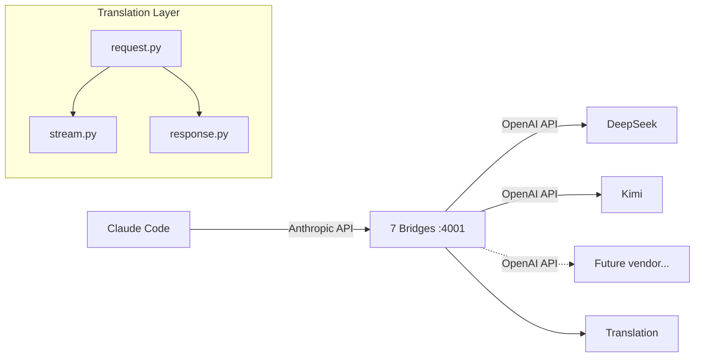
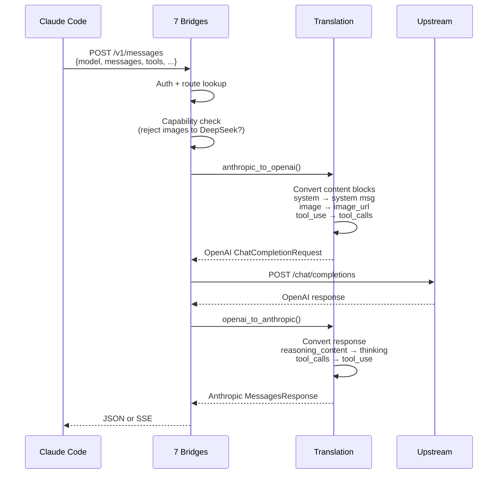
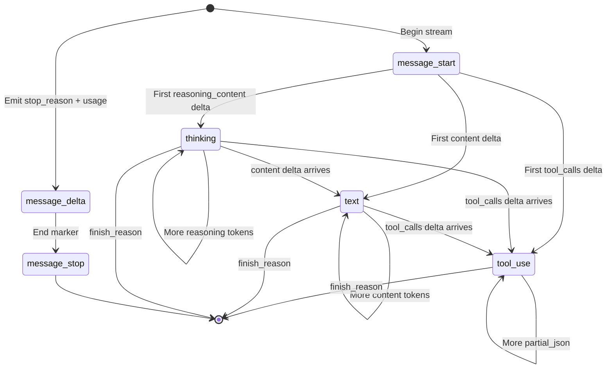

# Architecture

## Overview

7 Bridges of Claude is a **translation proxy**, not a generic LLM gateway. Every upstream vendor speaks its own API, but Claude Code only understands Anthropic's Messages API. The bridge's job is to make that gap invisible.



## Request Lifecycle



## Content Block Mapping

### Request (Anthropic → OpenAI)

| Anthropic Block | OpenAI Equivalent | Notes |
|---|---|---|
| `text` (string) | `content: "..."` | Direct pass-through |
| `text` (TextBlock in list) | `content: "..."` | Flattened to string |
| `image` (base64) | `content: [{type: "image_url", image_url: {url: "data:..."}}]` | Kimi only; DeepSeek rejects |
| `tool_use` | `tool_calls: [{id, type, function}]` | Preserved in assistant messages |
| `tool_result` | `content: "<tool_result>..."` | Flattened to XML-like string |
| `thinking` | `reasoning_content: "..."` | Extracted separately; not in content |
| `system` (string) | `messages[0]: {role: "system"}` | Prepended as system message |
| `system` (TextBlock[]) | `messages[0]: {role: "system"}` | Joined with newlines |

### Response (OpenAI → Anthropic)

| OpenAI Field | Anthropic Block | Notes |
|---|---|---|
| `message.content` | `TextBlock` | Direct |
| `message.reasoning_content` | `ThinkingBlock` | Signature is `""` (upstream has no signature) |
| `message.tool_calls` | `ToolUseBlock` | JSON arguments parsed |
| `finish_reason: "stop"` | `stop_reason: "end_turn"` | Mapped |
| `finish_reason: "tool_calls"` | `stop_reason: "tool_use"` | Mapped |
| `finish_reason: "length"` | `stop_reason: "max_tokens"` | Mapped |
| `usage.prompt_tokens` | `usage.input_tokens` | Mapped |
| `usage.completion_tokens` | `usage.output_tokens` | Mapped |
| `usage.prompt_cache_hit_tokens` | `usage.cache_read_input_tokens` | DeepSeek style |
| `usage.cached_tokens` | `usage.cache_read_input_tokens` | Kimi style |

## Streaming Translation State Machine

Streaming is the hardest part of the bridge. The upstream sends a firehose of SSE chunks; we must reassemble them into ordered Anthropic events.



### Block Indexing

Each content block gets a monotonically increasing index:

```
index 0: thinking block (if reasoning present)
index 1: text block (if content present)
index 2: tool_use block #1 (if tool calls present)
index 3: tool_use block #2
...
```

When the stream transitions from one block type to another, we emit `content_block_stop` for the previous block before `content_block_start` for the new one.

### Tool Call Streaming

OpenAI streams tool calls across multiple chunks, each containing a piece of the JSON arguments:

```
chunk 1: {tool_calls: [{index: 0, id: "call_1", function: {name: "get_weather", arguments: ""}}]}
chunk 2: {tool_calls: [{index: 0, function: {arguments: '{"location": "'}}]}
chunk 3: {tool_calls: [{index: 0, function: {arguments: 'NYC"}'}}]}
```

The bridge tracks partial JSON in a `tool_call_map` and emits `input_json_delta` events for each piece.

## Capability Gates

Each bridge declares its capabilities. Before translation, the request is validated:

```python
@dataclass(frozen=True)
class VendorCapabilities:
    supports_vision: bool = False
    supports_reasoning: bool = False
    supports_tool_calls: bool = True
    supports_video: bool = False
    max_tokens: int = 8192
```

If a request contains images but the vendor doesn't support vision, the bridge returns:

```json
{
  "type": "error",
  "error": {
    "type": "invalid_request_error",
    "message": "Model claude-sonnet-4-6 does not support image input"
  }
}
```

## Error Handling

Upstream HTTP errors are mapped to Anthropic-style error types:

| HTTP Status | Anthropic Error Type |
|---|---|
| 400, 422 | `invalid_request_error` |
| 401 | `authentication_error` |
| 403 | `permission_error` |
| 404 | `not_found_error` |
| 429 | `rate_limit_error` |
| 500, 502, 504 | `api_error` |
| 503 | `overloaded_error` |

## Project Layout

```
src/seven_bridges/
├── main.py              # FastAPI routing, auth, capability validation
├── config.py            # Model routing table (alias → bridge + backend_model)
├── debug.py             # Optional JSONL request/response logging
├── usage_log.py         # Per-request token usage logging to logs/usage.jsonl
├── models/
│   ├── anthropic.py     # MessagesRequest, MessagesResponse, ContentBlock, Usage
│   └── openai.py        # ChatCompletionRequest, ChatCompletionResponse, DeltaMessage
├── backends/
│   ├── base.py          # Bridge ABC, BridgeError, VendorCapabilities
│   ├── deepseek.py      # DeepSeek bridge (api.deepseek.com/beta)
│   ├── kimi.py          # Kimi bridge (api.kimi.com/coding/v1)
│   ├── fireworks.py     # Fireworks AI bridge
│   ├── siliconflow.py   # SiliconFlow bridge
│   └── ollama.py        # Ollama local bridge
└── translation/
    ├── request.py       # anthropic_to_openai()
    ├── response.py      # openai_to_anthropic()
    └── stream.py        # translate_openai_stream()
```

## Adding a New Bridge

1. **Create `src/seven_bridges/backends/<vendor>.py`**
   - Inherit from `Bridge`
   - Set `default_api_base`
   - Set `capabilities`
   - Implement `chat()` and `chat_stream()`

2. **Register in `src/seven_bridges/config.py`**
   - Add `Vendor_API_KEY` to `Settings`
   - Add model routes pointing to your bridge

3. **Wire up in `src/seven_bridges/main.py`**
   - Import your bridge class
   - Add case in `_get_bridge()`

4. **Write tests**
   - Add mocked e2e tests in `tests/test_e2e.py`
   - Test streaming, non-streaming, tool calls, error paths

The translation layer (`request.py`, `response.py`, `stream.py`) is generic — it works for any OpenAI-compatible backend. If your vendor uses a completely different API format, you'd write custom translation methods in the bridge itself.
